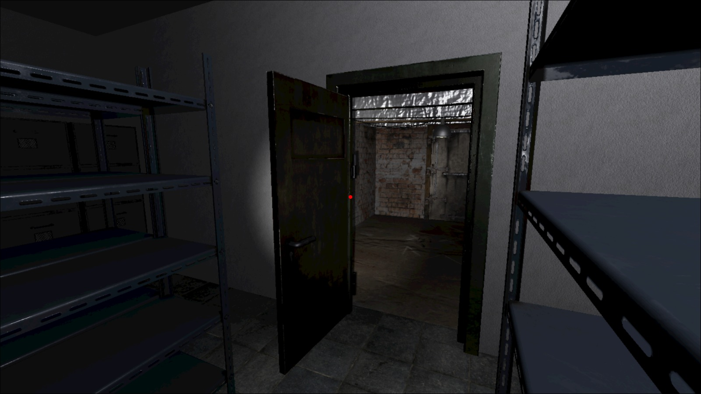
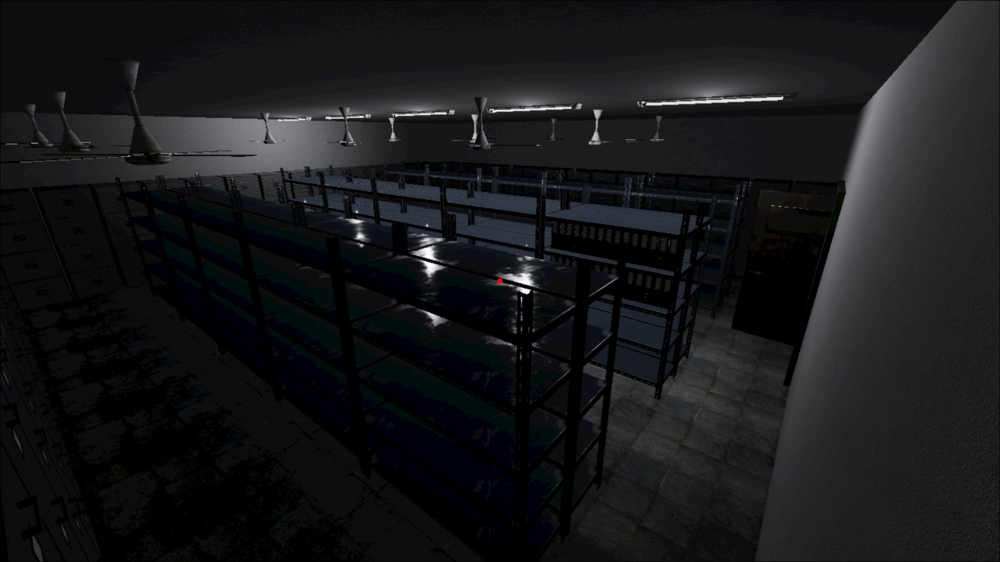
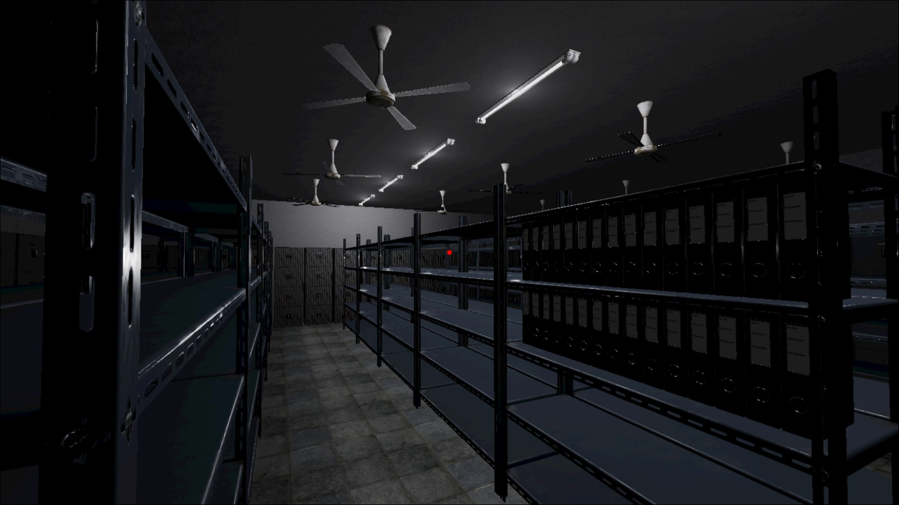
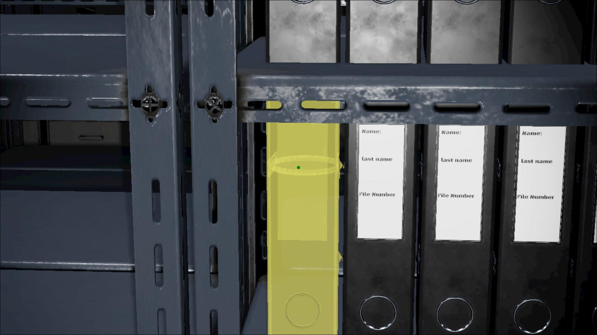
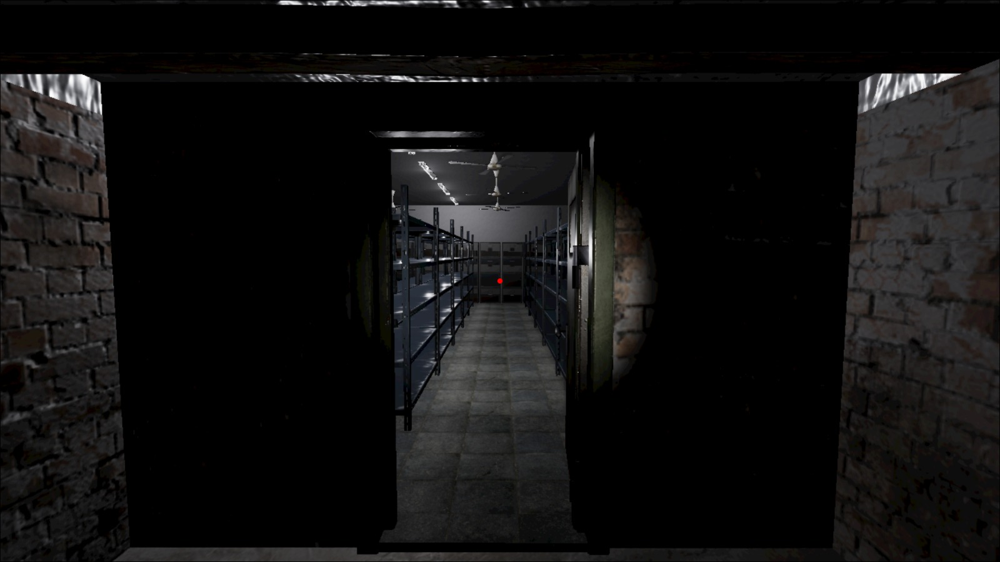
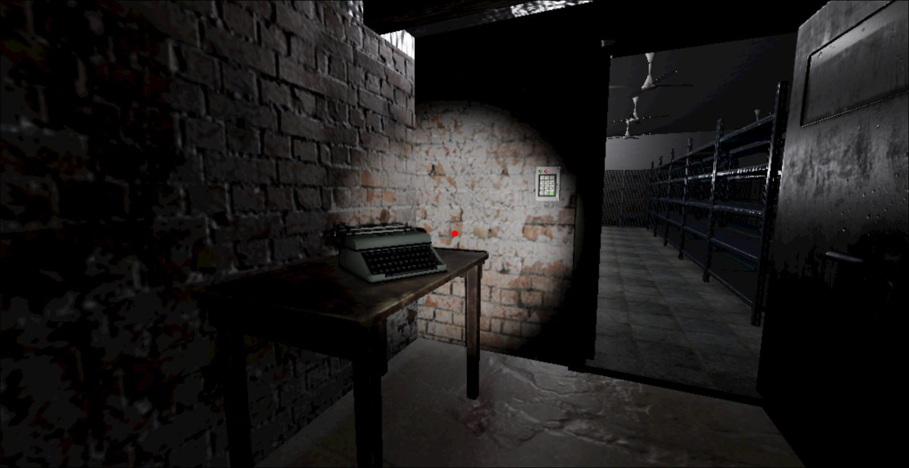

# Outlast Archive
3d File Manager

---

## Live Demo
[https://outlast-archive.web.app/](https://outlast-archive.web.app/)

---

## Overview  
**Outlast Archive** is a first-person horror like game where players explore their files.

We built the game using a **starter FPS template** for fps and lightning and some other 3d stuff if that is ok with the hackathon rules.

---

## Features  
**Immersive First-Person Gameplay** – Explore and interact with the environment.  
**Dynamic Lighting** – Atmospheric lighting enhances the horror experience.  
**Interactive Objects** – Players can pick up and examine items like files and typewriters.  
**Puzzle Elements** – Solve tasks to progress deeper into the archive.  
**Horror Ambience** – Designed to keep players on edge.  
**Backend Integration** – Connected with [Folder Heaven](https://github.com/BLLALL/folder-heaven) for storing and managing in-game files/data.  

---

## Tech Stack  
- WebGL: Threejs
- Starter FPS Template for core movement and lighting  
- **Backend:** Laravel [Folder Heaven](https://github.com/BLLALL/folder-heaven)  
- **Live Demo Hosting:** Firebase – [outlast-archive.web.app](https://outlast-archive.web.app/)  
- 3D assets sourced from **Sketchfab** (see credits below)  

---

## Assets & Credits  
The following 3D assets were used (not made by us):  

- [The Room](https://sketchfab.com/3d-models/the-room-b7e2af229435406782cd0103a22e53ce) – by **Delton Hulbert**  
- [Old Table](https://sketchfab.com/3d-models/old-table-c1391f05e2a046ef9bd91945caf75fb8) – by **EricKos**  
- [Typewriter](https://sketchfab.com/3d-models/typewriter-364545ff68024ea0b254853a5bdcd94d) – by **jesamabin**  
- [Folder (3MB)](https://sketchfab.com/3d-models/folder-3mb-daed6881547043b6b522c4c83590bf03) – by **Mehdi Shahsavan**  
- [Filing Cabinet (6MB)](https://sketchfab.com/3d-models/filing-cabinet-6mb-d217a4bbdfa2426eb32ebf3b1007a8c3) – by **Mehdi Shahsavan**  
- [Metal Shelf (5MB)](https://sketchfab.com/3d-models/metal-shelf-5mb-1621362eb54d4571a49323ceb74f80fb) – by **Mehdi Shahsavan**  
- [Ceiling Fan](https://sketchfab.com/3d-models/ceiling-fan-1c6ca23062ad4051aa4fe7d6483fb5c9) – by **bloooob**  
- [CC0 Keypad Door Lock](https://sketchfab.com/3d-models/cc0-keypad-door-lock-b722a6496ab344d78e74bf64be6c8eb8) – by **plaggy**  
- [Door](https://sketchfab.com/3d-models/door-2738468b94d74c5f827e7e5df7be8359) – by **DJMaesen**  

_All assets are credited to their original creators as per Sketchfab licensing._  

---

## Project Structure  

## Disclaimer  
- We used a **starter FPS template** for basic gameplay and lighting.  
- All **3D models are sourced from Sketchfab** and are **not created by us**.  
- Backend functionalities rely on [Folder Heaven](https://github.com/BLLALL/folder-heaven).

---

## How to Play  
1. Clone or download the repository.
2. Start a live server
3. Explore, survive, and uncover the archive’s dark secrets!
